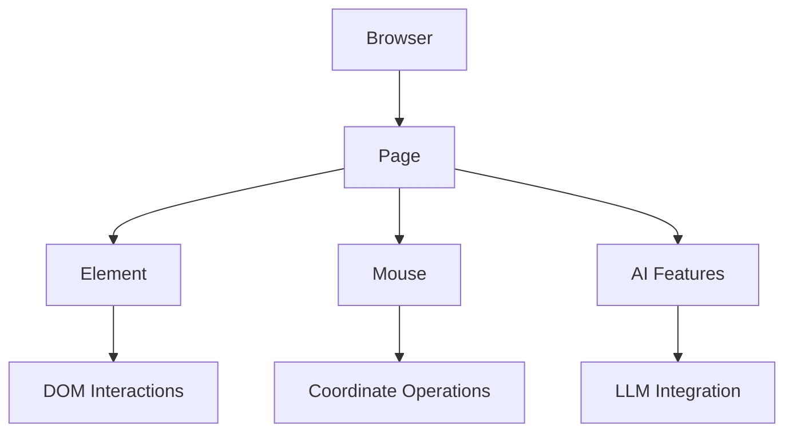

---
标题：“基础知识”
描述：“低层级类似Playwright的浏览器自动化，具备直接且完整的CDP控制及精准元素交互”
图标：“代码”
模式：“广角”
---
## 核心架构



### 核心课程

- **浏览器**（别名：**BrowserSession**）：主会话管理器
- **页面**：表示浏览器标签页/iframe。
- **元素**：单个DOM元素作
- **鼠标**：基于坐标的鼠标作

## Basic Usage

```python
from browser_use import Browser, Agent
from browser_use.llm.openai.chat import ChatOpenAI

async def main():
    llm = ChatOpenAI(api_key="your-api-key")
    browser = Browser()
    await browser.start()

    # 1. Actor: Precise navigation and element interactions
    page = await browser.new_page("https://github.com/login")
    email_input = await page.must_get_element_by_prompt("username field", llm=llm)
    await email_input.fill("your-username")

    # 2. Agent: AI-driven complex tasks
    agent = Agent(browser=browser, llm=llm)
    await agent.run("Complete login and navigate to my repositories")

    await browser.stop()
```

## 重要注释

- **非剧作家**：演员基于CDP，而非剧作家。API尽可能类似于Playwright以便迁移，但算是子集。
- **立即返回**：“get_elements_by_css_selector（）”不等待可见性
- **手动计时**：你负责导航计时和等待
- **JavaScript格式**：“evaluate（）”需要箭头函数格式：'（） => {}'
